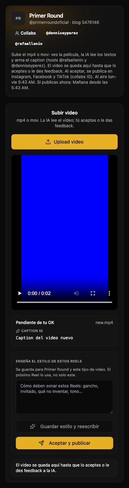
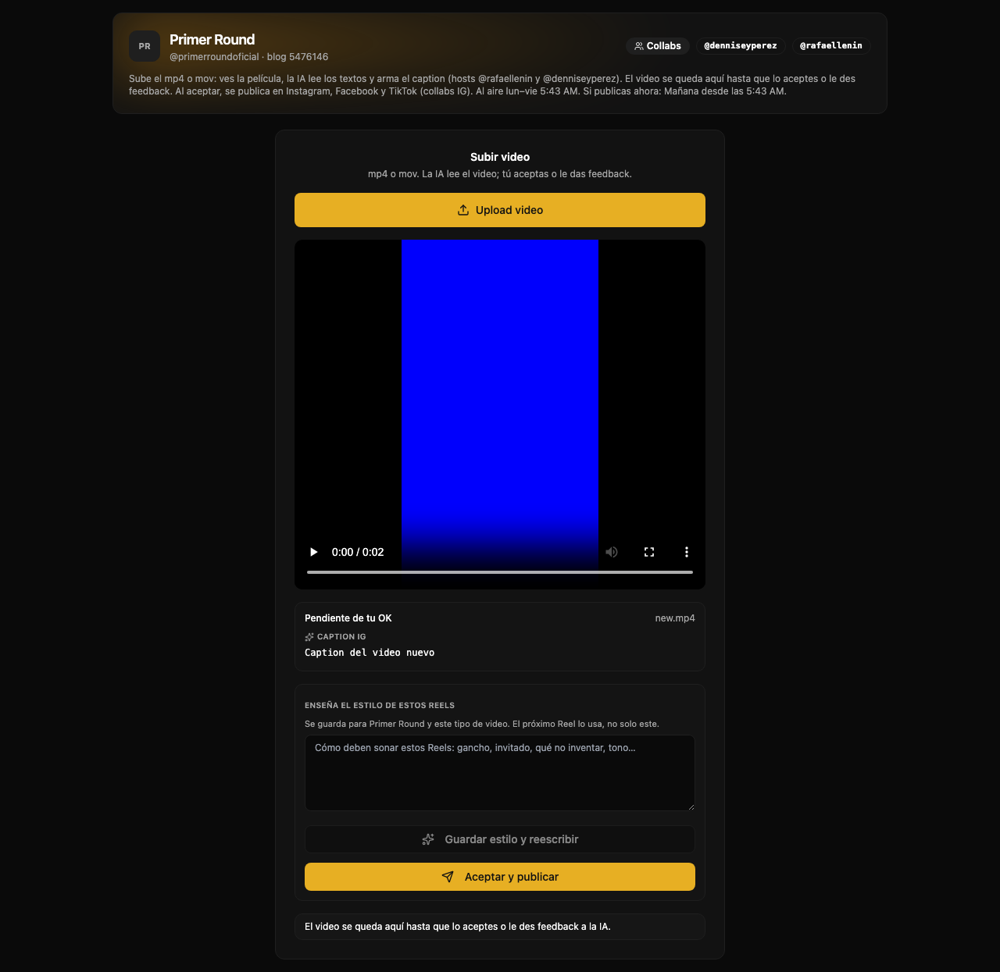

# QA — Primer Round: reemplazo del video después del upload

Fecha: 2026-09-14. Corrección: `d2ae94d`.

## Resultado

El nuevo archivo sustituye el reproductor anterior desde que se selecciona, permanece durante la subida y el análisis, y conserva su identidad aunque llegue una respuesta con la pieza pendiente anterior. La aceptación utiliza la idea y el video nuevos.

## Pruebas automatizadas

- 15 pruebas del componente: MP4 y MOV; progreso y bloqueo durante upload; datos anteriores durante creación y después de completar; error de creación, HTTP 500, red, timeout, respuesta sin key, registro, análisis y caption; volver a seleccionar el mismo nombre; liberación de object URLs; cancelación y extensión inválida; aceptación con los IDs nuevos.
- 81 pruebas relacionadas aprobadas: componente, página, reglas de Primer Round, registro R2 y procesamiento posterior al upload.
- `npx tsc --noEmit`: aprobado, también después de ampliar las pruebas.
- `npm run merge-gate`: aprobado (relaciones estáticas, guardas y dry-run del inventario R2).
- Ejecución inicial: **3305 aprobadas, 2 fallidas y 3 omitidas**, en 427 archivos; 86.31 segundos.
- Diagnóstico de los dos fallos de Entregas: `twoClients` se construía al cargar el archivo, antes de que `beforeEach` fijara la fecha. Se movió esa preparación a `beforeEach`; no se modificó el componente de Entregas. Sus 66 pruebas pasan.
- Revalidación de publicación sobre `github/main`, con las mismas exclusiones de CI: **3304 aprobadas, 0 fallidas y 3 omitidas**, en 426 archivos. Se excluyen las pruebas `*.live.test.ts`, igual que en CI.
- Revisión independiente: sin hallazgos funcionales; se corrigió la documentación para reflejar el diagnóstico de las fechas.

Comandos reproducibles:

```sh
npx vitest run components/primer-round/primer-round-studio.test.tsx --exclude '**/.claude/**'
npx vitest run lib/primer-round components/primer-round 'app/(dashboard)/primer-round/page.test.tsx' lib/utils/video-postupload-client.test.ts lib/actions/entregas-r2.test.ts --exclude '**/.claude/**'
npx tsc --noEmit
npm run merge-gate
npx vitest run --exclude '**/.claude/**'
npx vitest run components/entregas/entregas-board.test.tsx --exclude '**/.claude/**'
```

## Navegador

Se compiló y montó el componente real con React y los estilos del proyecto en un servidor local de pruebas. Las acciones de servidor y el análisis IA se simularon, y un endpoint HTTP local recibió el PUT. No se publicó contenido ni se modificaron datos de producción.

1. Video pendiente rojo: reproductor listo (`readyState=4`), píxel decodificado `[254,0,0,255]`.
2. Selección de MP4 azul: nueva URL blob y estado «Creando pieza…»; upload deshabilitado mientras procesa.
3. Se envían nuevamente los datos de la pieza roja durante la creación: el reproductor mantiene la URL nueva.
4. Después del PUT, registro y análisis: «Pendiente de tu OK», nombre `new.mp4`, caption nuevo y llamada con `new-idea` / `new-video`.
5. Fotograma decodificado del nuevo video: `[0,0,253,255]`, `readyState=4`. Se verificó contenido real del video, no solo el nombre.
6. Capturas en 375, 768 y 1280 px. Inspección visual de móvil y escritorio; sin desbordamiento horizontal en 375 y 1280 px.





## Alcance pendiente

Corrección y QA locales. No desplegado. La integración con R2/IA reales y la sesión autenticada de producción no se ejercitaron; esta ejecución no demuestra un upload de producción.
